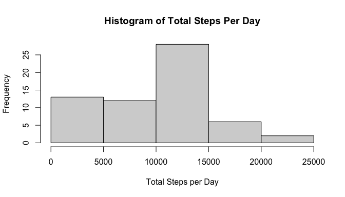
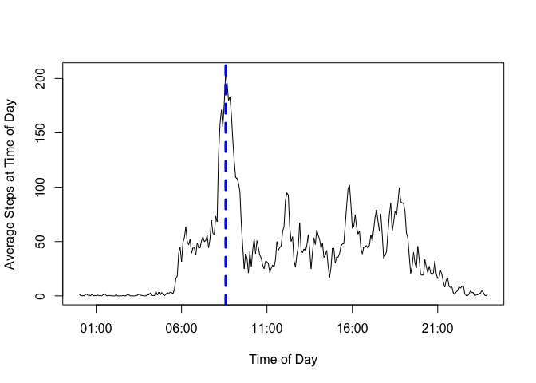
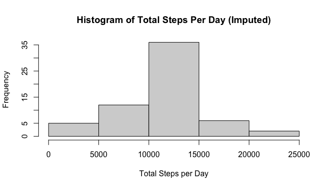
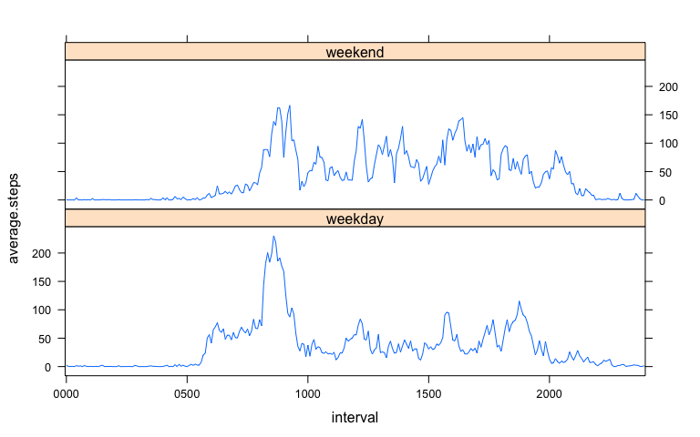

## Loading and preprocessing the data

As part of this report, I am investigating activity data collected from activity monitoring devices like FitBits, Apple Watch and Nike Fuelbands.   The data analyzed in this report consists of two months of data from an anonymous individual collected during the months of October and November, 2012 and include the number of steps taken in 5 minute intervals each day.  There are 288 intervals every day.

To start the analysis I am loading the data into a data frame, creating **cleanIntervals** variable to adjust the interval to be a easily parsed date/time string.   I then create 2 vairables and add it to the aData data.frame: a POSIX date which overwrites the **date** column and POSIX date/time which then overwrites the **interval** column.

Missing observations (i.e. steps counted for an interval) are left in **aData**.


```r
aData <- read.csv("activity.csv")

cleanIntervals <- sapply(aData$interval, function(x) {
  if(x<10) {paste("000", x, sep="")}
  else if (x<100) { paste("00", x, sep="")}
  else if (x<1000) {paste("0", x, sep="")}
  else {x}
})

aData$datetime <- strptime(paste(aData$date, cleanIntervals, sep=""), "%Y-%m-%d %H%M")
aData$date <- as.Date(as.character(aData$date), "%Y-%m-%d")
aData$interval <- cleanIntervals
```

## What is mean total number of steps taken per day?

The analysis needed to answer this question will ignore missing data, and calculate the sum of total steps for the individual represented in the data set.


```r
totalStepsByDay <- aggregate(x=aData$steps,by=list(aData$date), FUN=sum, na.rm=T)
```

To further understand how many steps were taken over two months, we look at the most frequent set of daily steps taken.   From the histogram below, se wee the subject most frequently managed to take between 10,000 and 15,000 steps per day.


```r
hist(totalStepsByDay$x, xlab="Total Steps per Day", main="Histogram of Total Steps Per Day")
```

<!-- -->

For this data set the average steps per day is ``9354.2295082``and the median steps per day is ``10395``.

## What is the average daily activity pattern?

It's also interesting to look at how the subject's activity occured across the day on average.  Here I calculate the *average* steps per interval across all days, and likewise also calculate the *median* steps per internal across all days.   Finally I find the interval that has the maximum number of steps and plot the average number of steps across all the intervals with a blue line indicating the interval representing the maximum.


```r
stepsByIntervalMean <- aggregate(x=aData$steps,by=list(aData$interval), FUN=mean, na.rm=T)
stepsByIntervalMedian <- aggregate(x=aData$steps,by=list(aData$interval), FUN=median, na.rm=T)

maxInterval <- stepsByIntervalMean[stepsByIntervalMean$x==max(stepsByIntervalMean$x), 1]
```


```r
plot(x=strptime(stepsByIntervalMean$Group.1, "%H%M"),y=stepsByIntervalMean$x, type="l", xlab="Time of Day", ylab="Average Steps at Time of Day")
abline(v=as.POSIXct(strptime(stepsByIntervalMean[stepsByIntervalMean$x==max(stepsByIntervalMean$x), 1], "%H%M")), lty=2, col="blue", lwd=3)
```

<!-- -->


It is clear from the the graph that the morning, before 11am is the most active time on average for this subject.   In fact, the maximum interval is 8:35 am, indicated by the raw value: ``0835``.


## Imputing missing values

While the averages and median above are a good indication of the activity of the subject, I wanted to investigate the impact of imputing data into the missing days.   Of the ``17568`` rows of activity data, there are about ``2304`` rows missing data.   

To fill in these missing data I will apply the average number of steps for the interval calculated above into a new data.frame called **cleanAData** and then evaluate the impact it has on the average steps per day and the median steps per day.   To populate the missing data I simply loop through a copy of the original activity data, and if a step value is missing (i.e. NA) then I grab the appropriate mean value from the analysis above and populate the steps variable.


```r
naIndex <- which(is.na(aData$steps))
cleanAData <- data.frame(aData)
for(i in naIndex) {
  cleanAData[i,]$steps <- stepsByIntervalMean[stepsByIntervalMean$Group.1==aData[i,]$interval,]$x
}
totalStepsByDayClean <- aggregate(x=cleanAData$steps,by=list(cleanAData$date), FUN=sum, na.rm=T)
```

Once the data is imputed and the data set is complete, I recalculate the frequency distribution of steps per day.  Unsurprisingly there is very little change in the subject's most frequent steps per day at: 10,000-15,000 steps, but the frequency count of all buckets does increase accordingly as there are no longer NA values to remove.


```r
hist(totalStepsByDayClean$x, xlab="Total Steps per Day", main="Histogram of Total Steps Per Day (Imputed)")
```

<!-- -->

Using the average steps does push the average and the median steps taken by day UP slightly as there are more data points at the average activity, hence likely over counting to some degree the subjects activity.    The new mean steps per day is ``1.0766189\times 10^{4}`` and the new median steps per day is ``1.0766189\times 10^{4}``

## Are there differences in activity patterns between weekdays and weekends?

It's also interesting to look at the difference in the subject's activity an weekdays versus weekends.   To investigate these differences I created a factor variable using my **datetime** column note whether a day was a weekend or weekday.    Once created I aggregated the data and took the average steps per interval for both weekends and weekdays.   Using this I prepared a lattice showing the average steps per interval for weekdays versus weekends.   


```r
cleanAData<-transform(cleanAData, weekend=ifelse((weekdays(datetime) %in% c("Sunday", "Saturday")),"weekend" ,"weekday"))
cleanAData<-transform(cleanAData, weekend=factor(weekend))
cwkDF <- aggregate(x=cleanAData$steps,by=list(cleanAData$interval, cleanAData$weekend), FUN=mean, na.rm=T)
names(cwkDF) <- c("interval", "weekend", "average.steps")
cwkDF<-transform(cwkDF, interval=factor(interval))
```


```r
xyplot(average.steps ~ interval | weekend, data=cwkDF, layout=c(1,2), type="l", scales=list(x=list(at=seq(1,288,12*5), labels=as.character(cwkDF[seq(1,288,12*5), 1]))))
```

<!-- -->

Based on this plot, the subject was active earlier and to a creater degree during weekdays, but generally more active throughout the day on weekends.

